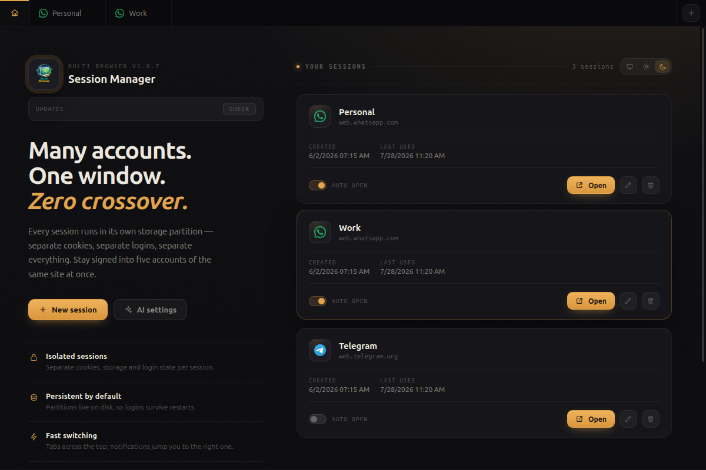
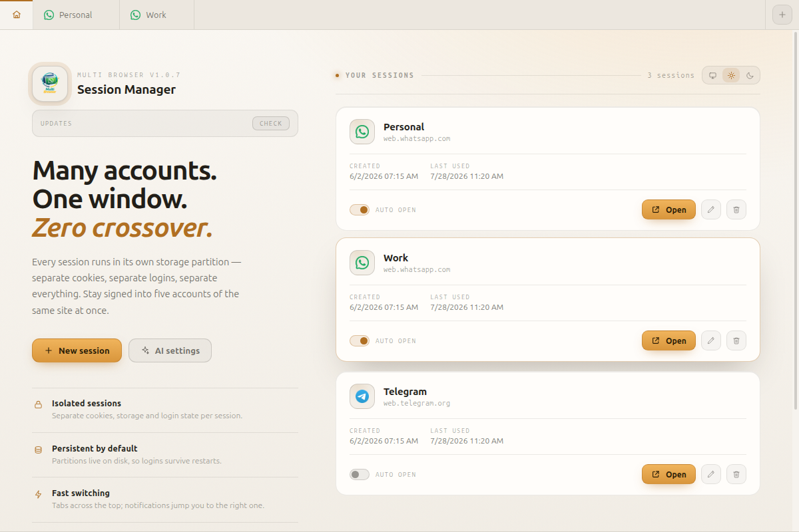

<div align="center">

# Multi Browser

**Many accounts. One window. Zero crossover.**

A desktop browser that runs each site in its own sealed session — separate cookies, separate
`localStorage`, separate logins. Stay signed into five WhatsApp accounts at once, side by side,
in one tabbed window.

[](https://github.com/guiperalta/multi-browser/releases/latest)
[](LICENSE)




</div>

## Why

Browsers give you one cookie jar per profile. Switching accounts means logging out, or juggling
profile windows, or giving up and using your phone. Multi Browser gives every session its own
storage partition, so two tabs of the same site never see each other — and the tabs live in one
window you can flip between.

Chromium is embedded (via Electron), so **no external browser is required**.

## Features

- **Fully-isolated sessions** — each one is a persistent Electron partition: cookies, `localStorage`, cache. Log into as many accounts of the same site as you like.
- **Persistent by default** — partitions live on disk, so logins survive restarts. Deleting a session wipes its data.
- **Tabbed UI** — create, rename, reorder your work across tabs; mark sessions to auto-open on launch.
- **AI assistant overlay** — review, translate, reply, summarize the text you're writing, in any session (`Alt+H`, or the floating button you can drag anywhere). Backed by the local **Claude CLI** (no key needed), **Claude API**, **OpenAI**, or **OpenRouter**.
- **Native notifications** — site notifications fire as real desktop notifications; clicking one raises the window and jumps to the right session, tab, and conversation.
- **WhatsApp deep links** — `whatsapp://`, `wa.me` and `api.whatsapp.com` links open in your WhatsApp session instead of failing to launch a native app.
- **Per-session spellcheck** — pick languages per session (defaults to Portuguese + English), with right-click suggestions and "add to dictionary".
- **Light and dark** — follows your system by default; switch it from the home screen.
- **In-app updates** — checks GitHub Releases, downloads, and installs, on every format it ships.

<div align="center">

</div>

## Download

Prebuilt installers are on the [**Releases**](https://github.com/guiperalta/multi-browser/releases/latest) page.

| Platform | File | Install |
|---|---|---|
| **Linux (Debian/Ubuntu)** | `multi-browser_<version>_amd64.deb` | `sudo dpkg -i multi-browser_<version>_amd64.deb` |
| **Linux (any)** | `Multi Browser-<version>.AppImage` | `chmod +x` it, then run it |
| **Windows** | `Multi Browser Setup <version>.exe` | Run it. The build is unsigned, so SmartScreen asks first — *More info → Run anyway*. |

macOS builds from source (`npm run build:mac`) but isn't shipped or notarized.

### Updating

The home screen has an **Updates** row: it checks on launch, and `Check → Download → Install`
does the rest. AppImage and Windows update silently; `.deb` and `.rpm` ask for your password once
(installing system packages needs root), then the app restarts itself. If PolicyKit/`pkexec` is
missing or cannot obtain authorization, Multi Browser opens the downloaded package in your system
package installer so you can approve the update there, then restart Multi Browser. If any update
step fails, the update row keeps its retry action and offers a link to download the latest release
manually.

## Run from source

Requires **Node.js 18+**.

```bash
git clone https://github.com/guiperalta/multi-browser.git
cd multi-browser
npm install
npm run dev      # verbose logging
npm start        # normal launch
```

Both scripts pass `--no-sandbox`; see [Troubleshooting](#troubleshooting) to keep Chromium's
sandbox on. Press **Ctrl+T** to fire a self-test notification.

## Build installers

Artifacts land in `dist/`. The version comes from `package.json`.

```bash
npx electron-builder --linux deb AppImage   # what we ship on Linux
npm run build:linux                         # deb + rpm + AppImage
npm run build:win                           # Windows .exe (nsis)
npm run build:mac                           # macOS .dmg
```

Pushing a version tag builds everything on GitHub Actions and publishes a Release:

```bash
npm version 1.2.3 --no-git-tag-version   # or edit package.json
git commit -am "chore: v1.2.3" && git push
git tag v1.2.3 && git push origin v1.2.3
```

## How it works

- **Isolation** — every session is a `WebContentsView` bound to a `persist:session-<id>` partition. The app shell (tab bar, home screen) is an ordinary renderer; page content never shares a process boundary with it.
- **Notifications** — a main-world hook *wraps* the site's `Notification` instead of replacing it, so the site's own click handler still opens the right conversation while the app raises the window and switches tabs.
- **WhatsApp links** — the app registers as the `whatsapp://` handler and normalizes `wa.me` / `api.whatsapp.com` URLs to `web.whatsapp.com`, routing them into the WhatsApp session.
- **Updates** — `updater.js` reads the GitHub Releases API, verifies the download against the asset's SHA-256 digest, and hands it to the right installer per package format.

[`CLAUDE.md`](CLAUDE.md) has the full architecture notes, including the parts that are subtle enough to have caused real bugs.

## Your data

- Sessions, preferences and AI settings live in one file in the per-user app data directory — `~/.config/multi-browser/sessions.json` on Linux, `%APPDATA%\multi-browser\` on Windows. Session cookies and storage live beside it, one directory per partition.
- **API keys and the update token are encrypted with the OS keychain** (Electron `safeStorage` — gnome-keyring/kwallet on Linux, DPAPI on Windows, Keychain on macOS) and stored as `enc:v1:…`. Keys saved by older builds are migrated on first launch. If the platform has no keychain, the app logs a warning and falls back to storing them as-is.
- Nothing is sent anywhere except the AI provider you pick, and only when you invoke an AI action. No telemetry, no analytics, no accounts.

## Troubleshooting

**Linux sandbox error** (`chrome-sandbox is owned by root and has mode 4755`)
Use `npm run dev` / `npm start` (they pass `--no-sandbox`), or fix the helper and keep the sandbox:

```bash
sudo chown root:root node_modules/electron/dist/chrome-sandbox
sudo chmod 4755 node_modules/electron/dist/chrome-sandbox
npm run dev:sandbox
```

**WhatsApp "Open app" links don't offer Multi Browser (Linux)**
Run once: `xdg-mime default multi-browser.desktop x-scheme-handler/whatsapp`

**Clicking a notification flashes the dock but doesn't raise the window (GNOME + Wayland)**
Mutter blocks apps from raising themselves; it affects every app and can't be fixed from app code.
Tab-switch and conversation-open still work. A GNOME extension such as *Steal My Focus Window*
works around it.

## Contributing

Issues and pull requests are welcome. Fork it, break it, make it yours — that's what the license
is for.

## License

[MIT](LICENSE) © Guilherme Peralta

<div align="center"><sub>Vibe coded by Guilherme Peralta — free to fork</sub></div>
